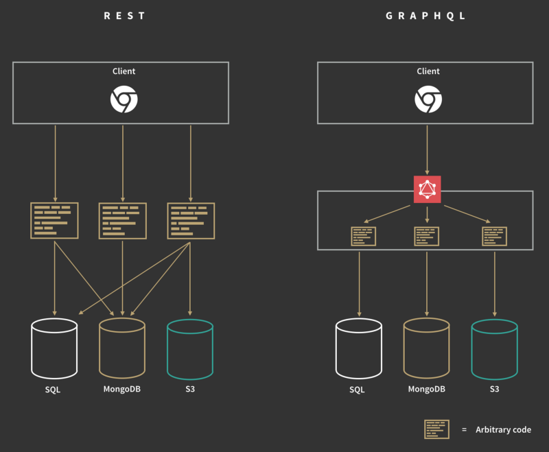

# @color[#DC143C](GraphQL)
#### Lightning Talk

@snap[south zoom-06]
#### Steven Atkinson
@snapend

---

### What is @color[#DC143C](GraphQL)?

@emoji[thinking_face]

---

@ul

- A @color[#DC143C](query language) for APIs
- A @color[#DC143C](runtime) for fulfilling queries with your existing data
- A way for giving clients the power to ask for @color[#DC143C](exactly what they need) and nothing more!

@ulend

---

@snap[midpoint span-60]

#### @color[#DC143C](REST) vs @color[#DC143C](GraphQL)

@snapend

---

### How do you use GraphQL?

@emoji[mag]

---

### Using
## @color[#DC143C](schemas)
#### and
## @color[#DC143C](resolvers)

---

# @color[#DC143C](Schemas)

---

@snap[zoom-06]
@ul

- Written in @color[#DC143C](Schema Definition Language) - @color[#DC143C](SDL)
- Strongly typed
- Define the API
- Three root types - @color[#DC143C](Query), @color[#DC143C](Mutation) and @color[#DC143C](Subscription)

@ulend
@snapend

---

@snap[fragment]
@code[graphql](assets/code/simple-schema.graphql)
@snapend

@snap[south span-100]
@[1](We must set the type to @color[#DC143C](Query))
@[2](@color[#DC143C](Define) a query and specify a @color[#DC143C](return type))
@snapend

@snap[fragment]
@code[graphql](assets/code/simple-schema-request.graphql)
@snapend

@snap[south span-100]
@[4](Specify that you want to run a @color[#DC143C](query))
@[5](Specify the @color[#DC143C](query))
@snapend

---

@code[json](assets/code/simple-schema-response.json)

@snap[south span-100]
@[3](Returns the server time as a @color[#DC143C](string))
@snapend

---

@snap[fragment]
@code[graphql zoom-07](assets/code/complex-schema.graphql)
@snapend

@snap[south span-100]
@[2](Returns an @color[#DC143C](array) of products)
@[5-11](The @color[#DC143C](type) that is used in the query response)
@[6-6,9-10](These are @color[#DC143C](required) parameters)
@[8](This is an @color[#DC143C](optional) parameter)
@snapend

@snap[fragment]
@code[graphql zoom-07](assets/code/complex-schema-request.graphql)
@snapend

@snap[south span-100]
@[12](Specify that you want to run a @color[#DC143C](query))
@[13](Specify the @color[#DC143C](query))
@[14-18](Specify what @color[#DC143C](attributes) you want)
@snapend

---

@code[json zoom-06 code-max code-noscroll](assets/code/complex-schema-response.json)

@snap[south span-100]
@[3](The @color[#DC143C](name) of the @color[#DC143C](query))
@[3-19](The @color[#DC143C](array) of @color[#DC143C](Products))
@[5-9,12-16](The @color[#DC143C](attributes) that we wanted)
@snapend

---

# @color[#DC143C](Resolvers)

---

@snap[fragment]
@code[graphql](assets/code/simple-schema.graphql)
@code[js](assets/code/simple-resolver.js)
@snapend

@snap[south span-100]
@[5](Create the @color[#DC143C](Query) property)
@[6](Create the @color[#DC143C](function) to resolver the query)
@snapend

---

@snap[fragment west span-50]
@code[graphql](assets/code/complex-schema.graphql)
@snapend

@snap[fragment east span-50]
@code[js zoom-06](assets/code/complex-resolver.js)
@snapend

@snap[south span-100]
@[6-10,15-19](Object properties map the type in the schema)
@snapend

---

### You can
## @color[#DC143C](EXPLICITLY)
## @color[#DC143C](DEFINE)
### types

---

@code[js code-max code-noscroll](assets/code/complex-resolver-define-type.js)

@snap[south span-100]
@[7-13](Add the @color[#DC143C](type) to the resolver)
@[8-10](Attributes mapped explicitly to the object properties)
@[11](Attribute is transformed)
@[12](Attribute is the result of a condition against another property)
@snapend

---

### @color[#DC143C](Queries)
#### with
## @color[#DC143C](PARAMETERS)

---

@code[graphql](assets/code/query-with-parameter.graphql)

@snap[south span-100]
@[2](The @color[#DC143C](id) parameter of the type @color[#DC143C](ID))
@[2](@color[#DC143C](ID!) means that the parameter is @color[#DC143C](required))
@snapend

---

@code[js zoom-09 code-max code-noscroll](assets/code/resolver-with-parameter.js)

@snap[south span-100]
@[1-7](We have some mock products)
@[10](The second parameter is the @color[#DC143C](parameters) sent to the query)
@[10](We use destructuring to extract the @color[#DC143C](id) parameter)
@[11](Then we @color[#DC143C](return the product) with the passed in ID)
@snapend

---

# @color[#DC143C](Mutations)

---

@code[graphql](assets/code/simple-mutation-schema.graphql)

@snap[south span-100]
@[1](We must set the type to @color[#DC143C](Mutation))
@[2](We pass in a @color[#DC143C](String) and return a @color[#DC143C](String))
@snapend

---

@code[js](assets/code/simple-mutation-resolver.js)

@snap[south span-100]
@[2](Create the @color[#DC143C](Mutation) property)
@[3](Create the @color[#DC143C](function) that runs the mutation)
@[4](This mutation @color[#DC143C](echos) what was passed in)
@snapend

---

@snap[fragment]
@code[graphql](assets/code/simple-mutation-request.graphql)
@snapend

@snap[south span-100]
@[1](Specify that you want to run a @color[#DC143C](mutation))
@[1](Specify the @color[#DC143C](parameters) and @color[#DC143C](types))
@[2](Specify the @color[#DC143C](mutation) with the @color[#DC143C](parameter))
@snapend

@snap[fragment]
@code[graphql](assets/code/simple-mutation-request-variables.json)
@snapend

@snap[south span-100]
@[4-7](Specify the @color[#DC143C](variables))
@[5](Set the @color[#DC143C](variable) that will be passed as a @color[#DC143C](parameter) to the mutation)
@snapend

---

@code[json](assets/code/simple-mutation-response.json)

@snap[south span-100]
@[3](This mutation @color[#DC143C](echos) what was passed in)
@snapend

---

@code[graphql](assets/code/complex-mutation-schema.graphql)

@snap[south span-100]
@[1](We must set the type to @color[#DC143C](Mutation))
@[2](@color[#DC143C](Define) a mutation and specify a @color[#DC143C](return type))
@[5-10](We define a custom @color[#DC143C](input) to pass in to the mutation)
@[6-9](We specify the @color[#DC143C](attributes) for the input)
@snapend

---

@snap[fragment]
@code[graphql](assets/code/complex-mutation-request.graphql)
@snapend

@snap[south span-100]
@[1](Specify that you want to run a @color[#DC143C](mutation))
@[1](Specify the @color[#DC143C](parameters) and @color[#DC143C](types))
@[2](Specify the @color[#DC143C](mutation) with the @color[#DC143C](parameter))
@[3-7](Specify the @color[#DC143C](attributes) you want)
@snapend

@snap[fragment]
@code[json](assets/code/complex-mutation-request-variables.json)
@snapend

@snap[south span-100]
@[11](Set the @color[#DC143C](variable) that will be passed as a @color[#DC143C](parameter) to the mutation)
@[12-15](Set the @color[#DC143C](input properties))
@snapend

---

@code[json](assets/code/complex-mutation-response.json)

@snap[south span-100]
@[3](The @color[#DC143C](name) of the mutation)
@[4-8](The @color[#DC143C](attributes) that we wanted)
@snapend

---

## Serverless
# @color[#DC143C](GraphQL)

---

@snap[north]
### The Good
@snapend

@snap[zoom-06]
@ul

- No need to make multiple requests to fetch data
- You can create resolvers that talk to third party APIs
- It can be used as an @color[#DC143C](API Gateway)
- It can @color[#DC143C](aggregate data) from many sources
- The @color[#DC143C](GraphQL playground) makes it easy to debug queries and mutations
- You only get the @color[#DC143C](data you need)

@ulend
@snapend

---

@snap[north]
### The Bad
@snapend

@snap[zoom-06]
@ul

- Every request is a POST - @color[#DC143C](no HTTP caching)
- GraphQL could become big and bloated - @color[#DC143C](lots of types, queries, mutations etc)
- It is another @color[#DC143C](new syntax) to learn

@ulend
@snapend

---

@snap[north]
### Resources
@snapend

@snap[zoom-06]
@ul
- https://github.com/mrstebo/graphql-serverless-boilerplate
- https://medium.com/hotels-com-technology/pros-and-cons-of-graphql-2ec9104c74f2
- https://www.moesif.com/blog/technical/graphql/REST-vs-GraphQL-APIs-the-good-the-bad-the-ugly/#
@ulend
@snapend

---

# @color[#DC143C](FIN)
